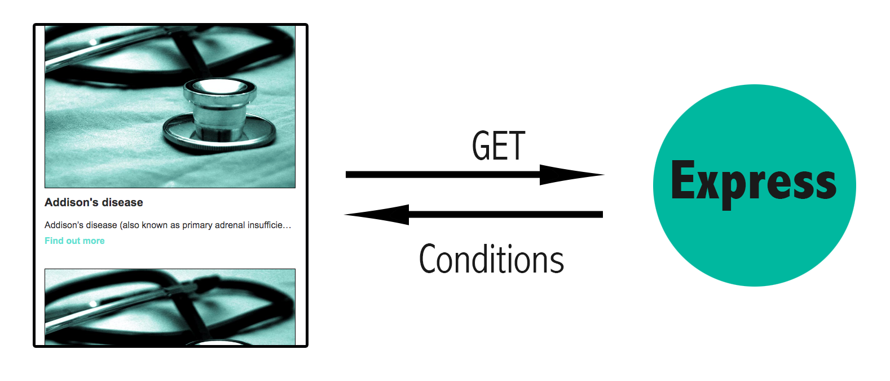

## React/Redux Thunk and Next.js integrated with Express

The App is a React Website that will request information to an Node/Express server to show a list of items.

<p align="center">
  
</p>

## FrontEnd

* React
* Redux
* Next

Other packages used:

* styled-components
* prop-types

## Backend
* Express

## Testing
* Jest & Enzyme (unit testing)
* Cypress (e2e testing)


## Considerations

* We will use NextJS as a boiler plate for React
* The server will response with a 3 seconds delay (to give time to the FE to show a Spinner)
* Due to the images are not accesible, the FE will show a default image if is needed
* If in a condition, the snippet parameter is not available, the CTA "Will not be visible"

## Folders

*  __tests__: Unit test
*  components:  React components used in the FE
*  constants:   Configuration files
*  cypress/integration:  e2e tests
*  pages:  pages folder
*  public: static files folder
*  redux: store, reducers & actions
*  server: Express node server

## Main commands

```bash
# Install the dependencies
npm install

# Run website and backend in dev (hot reload) mode 
# http://localhost:3000 for FE and http://localhost:9000/conditions for the backend
npm run start

# Run unit tests
npm run test

# Run end2end testing with Cypress
npm run cypress

# Run using Docker compose
docker-compose up
```

Once we launch the app (using 'docker-compose up' or 'npm run start') we will need to open a browser and access to the url: http://localhost:3000
